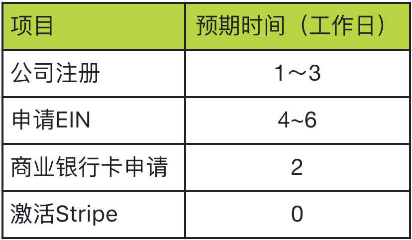

## 写在前面

哈喽👋，大家好，我是Vince，独立创业者，程序员兼产品经理，之前主要做国内的App项目，方向主要是工具类产品，因为重点想在AI领域做一些有价值的产品，所以从国内卷到了海外，海外从0起步，需要一个公司主体，以便开展各种业务，一般从国内出海的朋友大多会选择在香港、新加坡或者美国成立主体，为了之后更方便的开展业务，同时也为了节省一些成本，综合考虑后决定在美国成立一个公司主体。

毕竟对创业者来说，创业的第一天就在和成本做对抗，所以有些费用咱们能省则省。

虽然已经在网上搜集了许多关于注册海外公司的教程，但也难以避免在开通支付的时候走很多弯路，所以我把这些弯路“画出来”，而你也许并不必走这些弯路。

本篇文章不包含任何营销广告，完全是个人的经历，请放心观看。

注册美国公司并且开通Stripe有四个步骤分别是：

> - Step1：注册美国公司
> - Step2：申请EIN
> - Step3：开通银行卡
> - Step4：激活stripe

我是从9月10号开始注册公司的，到10月9号激活stripe支付总共用了30天时间，花费了204美金，卡点就是在申请美国的商业银行卡上，后面我会详细介绍我申请过的银行和失败的情况。

先看下注册公司所预期的时间：

也就是基本上只需两周时间你就可以完成注册和激活流程，下面分步详细介绍整套流程：

我们可以先看下 [step1 注册美国公司](./step1-注册美国公司.md)