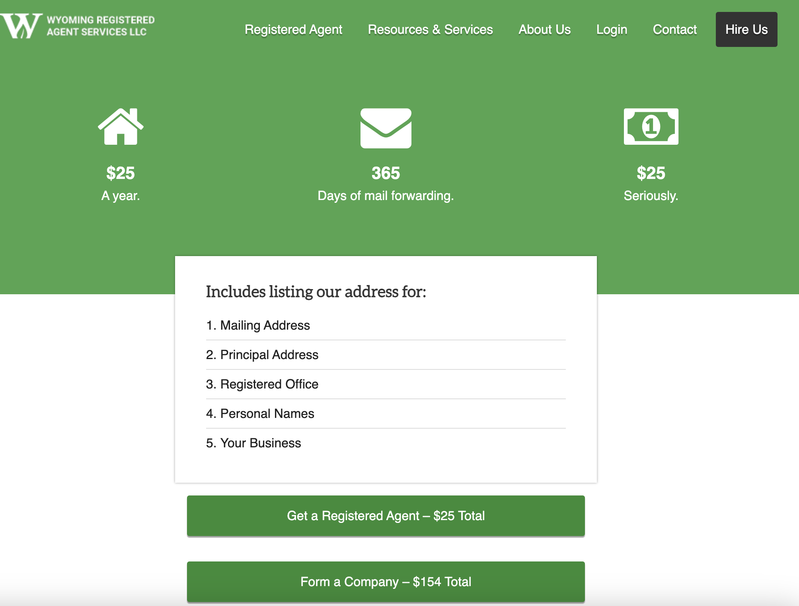

## Step1 注册美国公司

注册公司可以有很多选择，但大致分为两个途径：代理代办/全流程自主办理，代理代办的话我们除了可以选择某宝之外，也可以选择像Stripe Atlas或者Firstbase，提供全流程代办，比较省心，费用大概在500美金左右，但我们本着节省成本的原则，本篇主要介绍全流程自主办理。

我选择的是 Wyoming 州注册，Wyoming 无州收入税和特许经营税，更强的隐私保护，同时也具有更低的维护费用。

1.注册公司链接： https://www.wyomingagents.com/

2.资料填写：

直接在网站上选择“From a company”即可，无需登录，等通过之后会相关的注册流程。

按照要求填写信息：

Desired Company Name&Alternative Company Name （期望名称和备用名称）：用英文填写你想给公司起的名称，备用名称是在你的期望名称已经被注册或者不被允许使用时作为备选使用，为避免重合，名字最好用两个英文单词的组合比如OpenAI、ByteDance，尽量使用帕斯卡命名法，即每个单词的首字母都大写；

Business Entity Type（企业类型）：因为我们在初期一般是单一成员，所以选择LLC即可；

Notify Your Attorney of a Lawsuit (通知您的律师有关诉讼)：选择NO即可；

"We'll file your Beneficial Ownership Information for you" (我们将为您提交实益所有权信息)：这个建议勾选上。

Filing Options（申报选项）：这里我们默认勾选（$104.00 — Standard）；

Management Information（管理信息）：我们默认Member Managed（会员管理）；

Member（成员姓名）：按照要求填写即可。

Contact Information（联系信息）：电话号码我们可以填写自己真实的电话号码；

Physical Address（物理地址）：我们填写自己真实的居住地址信息。

Account Setup （账户设置）：填写自己常用的邮箱地址，密码按照要求设置即可；

Wyoming Business Presence（怀俄明企业业务）：这个默认勾选，属于是赠送，有需要的可以使用，虽然可能也没什么用，域名我们一般自己注册，后面我会出教程介绍如何免费开通企业邮箱。

Recommended Items （推荐项目）：Annual Report Compliance（年度报告合规）我们默认勾选上即可，按照美国的法律，我们需要在公司成立的周年日提交，不然会有被解散的风险。其他的比如 Corporate Supplies（公司用品）、Trademark Service – $499（商标服务 – 499美元）、Trade Name (DBA) – $225（商业名称（DBA）– 225美元）等需要收费的项目，我们都不需要勾选了，如果真的有需要找代办也许费用更低一些，我们主打一个性价比～

Billing Information  （账单信息）：我们填写自己的Visa信用卡信息，确认无误之后点击提交，总共付费金额179美金，提交之后在3-5分钟内就能收到扣款短信，如果没有收到可能是网络延迟导致提交信息失败，就需要重新提交了（别问我怎么知道的😭）。

以上都完成后，我们大概需要等待1-3天就可以收到注册成功的邮件了～

3.资料确认

接下来，我们登录网站，确认订单上填写的信息，后面的过程就比较简单了，以下为具体的确认过程：

点击继续挨个确认下面的信息包括Address（地址信息）等等。

信息确认完毕之后，会给你一个美国的代理地址，这个地址就是公司注册地址，后面申请还会用到，记住最好，记不住也没关系，后面申请下来的文件也会包含这个地址。

过两天我们注册公司完毕之后所得到的相关文档，包括：Operating Agreement（运营协议，重要文件）、Initial Resolution（初始决议）、Formation Document（成立文件），可以把这几个文件给到chatgpt，后面可以协助你申请。

到这一步，基本上就完成了注册美国公司80%以上的流程，接下来20%就是申请EIN，EIN 是 Employer Identification Number 的缩写，中文为雇主识别号码。它是由美国国税局（IRS）发放的一个独特的九位数字，用于识别企业实体。EIN 类似于个人的社会安全号码（SSN），但它是专门为企业、合伙企业、非营利组织、信托以及其他机构用于纳税和商业运作的识别码，所以我们想在美国开展业务就必须要这个识别码，接下来就是[step2 申请EIN](./step2-申请EIN.md)。