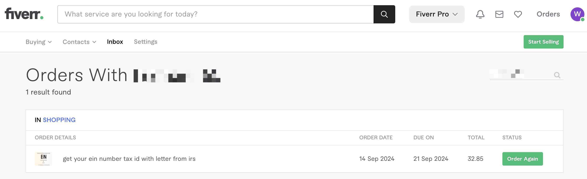

## Step2 申请EIN

申请EIN同样也可以自主办理，可以去美国国税局（IRS）办理，但是需要填写的资料还是蛮多的，所以为了最高的性价比我选择了找代办，某宝和Fiverr都可以找代理办理，价格并不高，我通过Fiverr算上服务费花了总共32.85新币，大概25美金。

打开Fiverr，网址：https://www.fiverr.com/

输入EIN搜索，可以看到有很多可以代办的代理人，我选择了一个价格相对低一些而且评分高一些的代理人，然后交谈说清楚你的需求后，代理人会让你提供：

> - 1 Company Article/Formation certificate（公司章程/成立证书）
> - 2 Owner Full Name（公司所有者全名）
> - 3 Members in Company（公司成员）
> - 4 Business industry（行业类别）
> - 5 Business phone number (optional)（公司电话号码（可选））

按照要求提交给代理即可，其中公司章程就是我们申请公司获得的Formation Document（成立文件）。

你提交给代理人之后，代理人会告诉你大概需要4-6个工作日就可以完成申请，我大概用了7个自然日拿到了EIN。

以上我们就完成了所有注册美国公司的流程，但是我们是希望在美国开展业务，所以还需要申请美国银行卡，方便我们转账收款，接下来就是[step3 开通银行卡](./step3-开通银行卡.md)，也是我走了最多弯路的流程～

