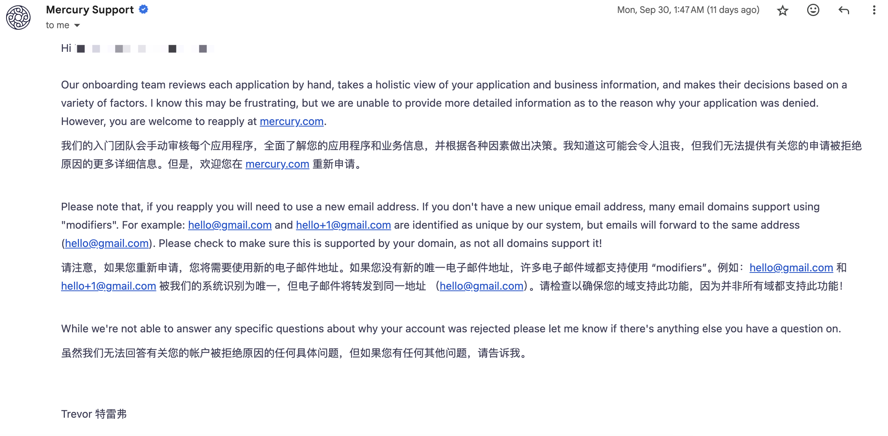
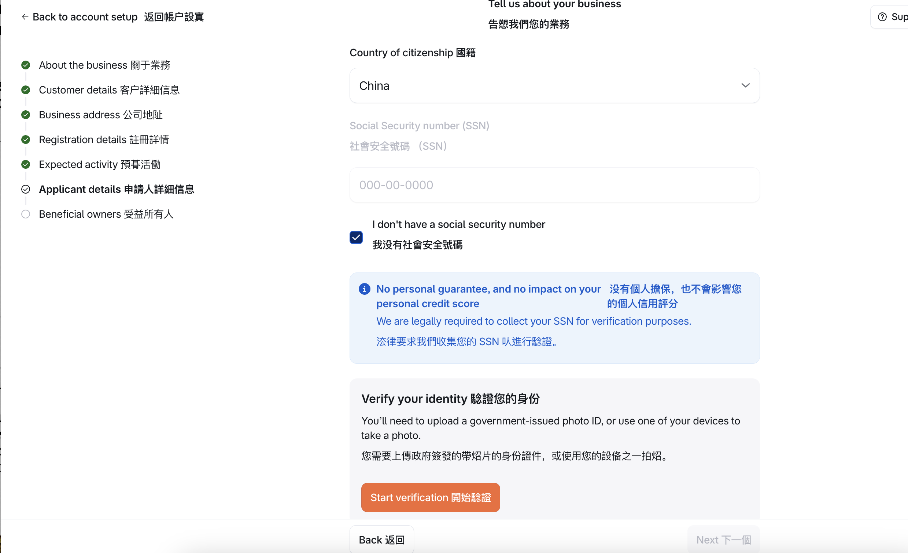
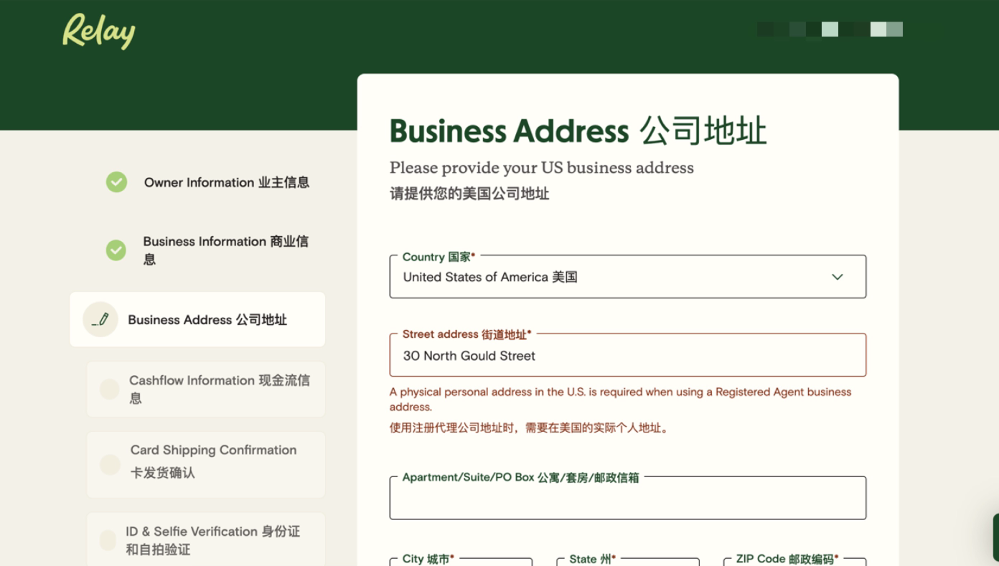
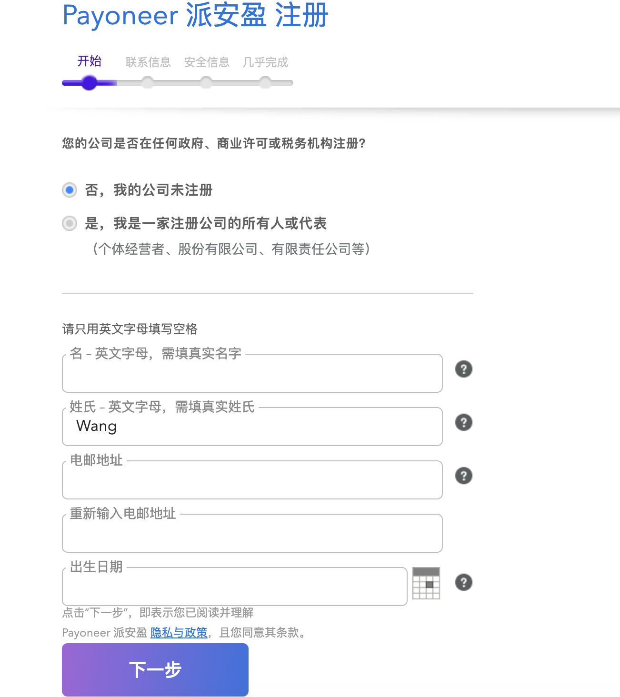
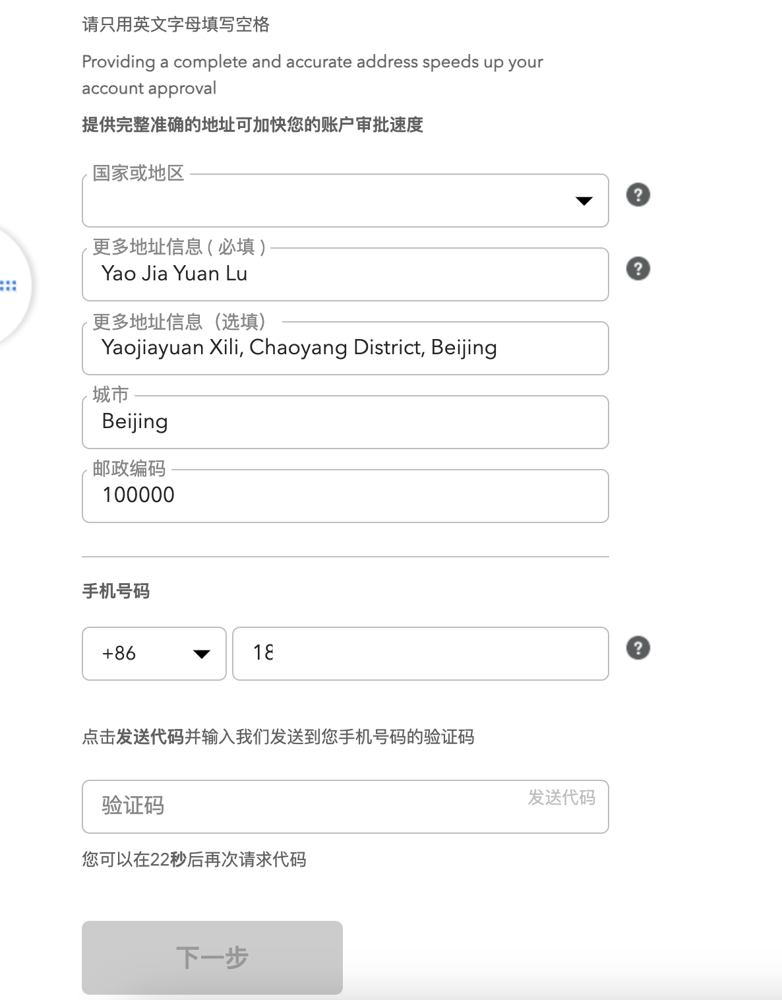
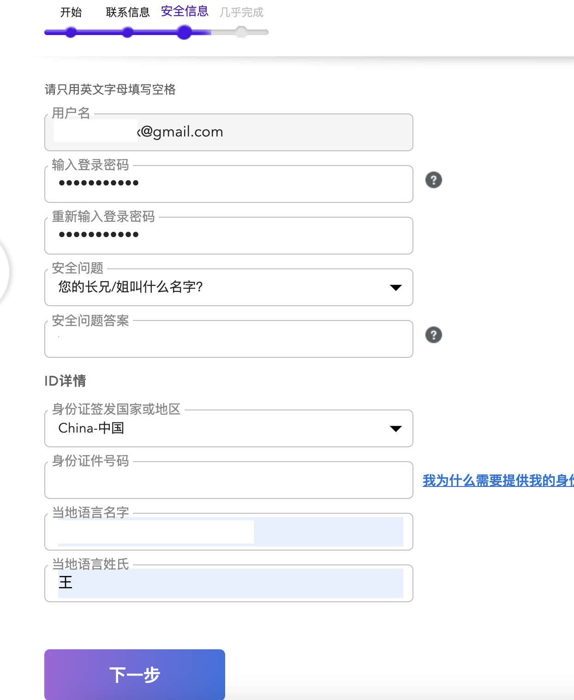
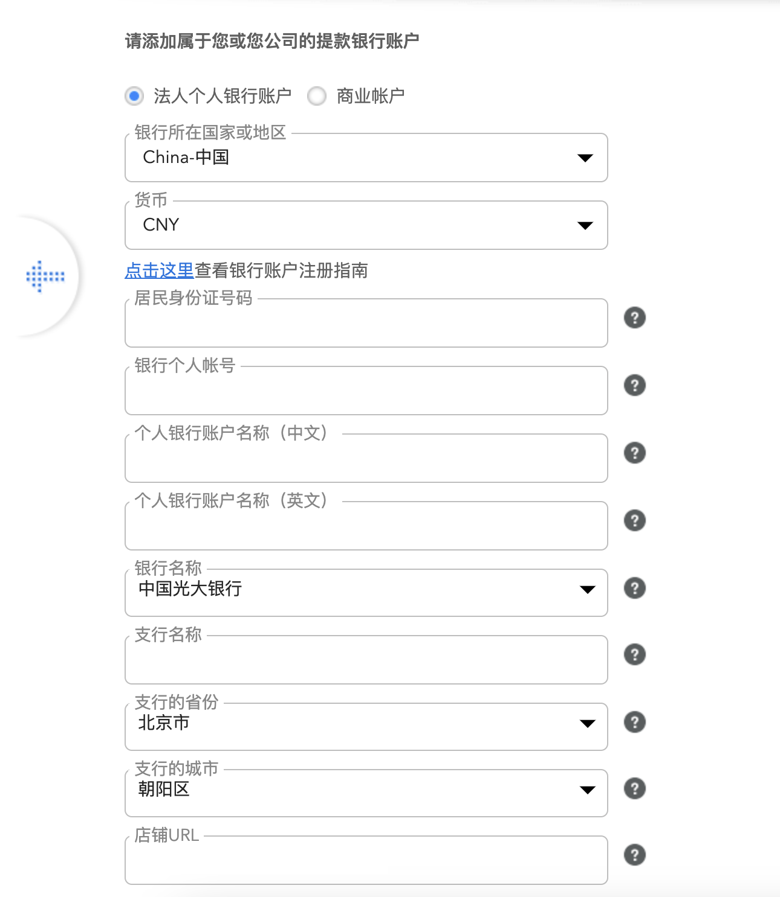
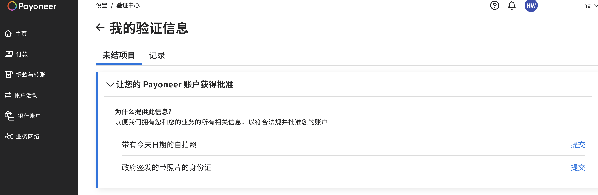
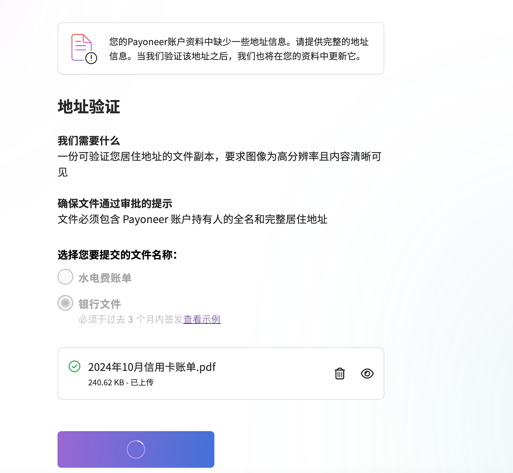

## Step3 开通银行卡

美国银行卡的申请算是承上启下了，是对于我们公司主体能力的补充，也是方便激活我们的stripe账户。

美国银行卡的申请同样也可以通过代理办理，但是一般都需要比较高的费用，我咨询过比较少的也需要是在人民币3000元左右，我们肯定还是选择自己申请，以下是申请的详细教程，但我会先把我申请失败的银行贴出来，避免你踩坑。

失败案例：

1.Mercury Bank（水星银行）：水星银行是公认的出海相对方便申请的银行，它并不是严格意义上的实体银行，算是一种数字银行服务，但是具有实体银行账户的功能，在今年之前都算是比较好申请的银行，基本上按照要求填写相关的资料都可以通过，但是今年整体上国内申请水星银行的通过率极大的下降，整体的银行风控更加严格，可能需要有一些背书，比如投融资情况等等，对于刚刚出海，而且是刚申请下来的公司主体，在没有太多信用积累的情况下基本上不太会通过，我前后申请了两次，也发邮件咨询过申请失败的原因，但是出于风控因素，并没有得到具体的回复，但我还是建议新注册的公司在同步好EIN之后，使用稳定且独立的IP地址试试。

2.Brex：同样也是对starup比较友好的电子银行，我卡在了验证身份这一步，对于国内身份的用户无法提供相关的认证服务（获取不到相应的信息）。

3.SVB（硅谷银行）：提交了相应的请求，预计2个工作日内反馈，但迟迟得不到任何回应。

4.Zyla：万里汇在北美合作的电子银行，提交了相应的资料，被反馈无法开立账户。

5.Novo：需要申请人有SSN。这里简单介绍下SSN和ITIN：

> - SSN 是为美国公民、永久居民（绿卡持有者）、以及临时工签证持有者等颁发的主要身份识别号码。SSN 用于社会保障（Social Security）福利、报税、申请贷款、开设银行账户等多个方面。
> - ITIN 主要用于没有资格获得 SSN 的个人，用于联邦税务申报和处理。这类号码不授予工作权利，也不意味着该个人享有社会保障福利。它主要为非美国公民、非居民外籍人士以及其他不具备 SSN 资格的个人使用。

6.Payoneer（派安盈）：如果是开通企业商业账户，需要拥有美国银行公司账户（😭我不就为了公司有个银行账户嘛）才可以申请。

7.Wise：开通银行账户需要31美金，在我申请这么多银行失败的情况下，暂时作为备用选项，当然咱们还是继续看看有没有什么免费获取银行账户的方式。

8.Axos Bank：也是一家电子银行，但是同样需要SSN才可以申请。

9.Bluevine：电子银行，可能需要稳定且私有的海外IP地址才可以申请，我打开的时候总是404。

10.Airwallex（空中云汇）：填写完资料后被拒，和官方的业务人员联系后，得知审核人员对于AI工具类产品审核力度变得严格，除非产品开发完毕可以体验之后，业务人员可以帮忙申诉一下，当时产品还在开发当中，暂时没有申诉，不过后面可以再申诉一下，同样我建议新申请的同学在提交审核的时候可以先写别的行业试试。

11.Revolut：资料填写完毕之后，提示已经进入waitlist，显示后续有消息会通知。

12.Relay：在使用注册公司地址的时候，需要在美国有实际的个人地址，当前公司注册地址不被允许认证。

13.万里汇：蚂蚁集团的子公司，办理美金个人银行账户，需要有店铺信息或者具体的网址，对跨境电商比较友好，不过我提交的信息被拒，如果你们有具体的经营网址可以再试试。

14.North One：需要美国的IP地址，而且需要有美国的电话卡。

15.Square Banking：仅包括美国在内的少数几个国家可以用其电话卡注册。

## 具体申请流程：

当然还有一些其他的银行我也做了一些尝试，这里就不再赘述了，整体上感觉是走了巨多弯路。

出海的产品一般习惯使用Stripe支付，但是Stripe支付需要有个海外的提现银行卡，那我们只要有这一张提现银行卡就可以完成激活，也就是我们在出海的前期其实对于一定要有一个公司银行账户的需求并不是特别高，提现银行卡为了合规肯定是尽量用公司的，但是为了业务更快的上线，我们可以先开通个人虚拟商业银行账户激活Stripe支付，后面我们产品上线之后，我们可以再申诉或者申请其他银行，这样开通公司银行账户的概率更高一些。

前面我提到了我们使用Payoneer开通企业银行账户失败，其实Payoneer还有一个选项可以开通法人个人银行账户，接下来我介绍下详细的注册流程。

按照要求填写后点击下一步：

国家或地区我们选择中国，更多地址信息的话我们用英文填写我们实际的居住地址即可，这里需要注意的是⚠️，如果你的身份证地址并不是你的居住地址的话，后面可能需要填写关于居住地址的水电缴费信息（包含你的名字）或者你的银行卡最近三个月的交易信息（包含你的名字和详细的地址信息），当然你也可以把你的居住地址改到和身份证地址保持一致，然后选择国内的手机号进行验证，验证完成后点击下一步。

用户名这里默认就是我们的邮箱，安全问题的答案需要用英文，填写好自己的身份证号以及中文的姓名即可点击下一步。

我们选择法人个人银行账户，地区和货币的话我们保持默认，绑定好身份证号以及银行卡，店铺地址我们输入我们的网站网址，然后点击提交。

大约几个小时后会邮件提醒我们验证信息，我们进入账户验证信息，分别需要提交的是带有今天日期（手持A4纸）的自拍照，和身份证正反面信息。

提交后也许还需要我们验证下我们的地址信息，按照之前的要求验证就行，我使用的招商银行的信用卡可以添加上姓名和地址信息以确保完全匹配。

账户开通之后我们，我们还需要填写一个调查问卷，即可申请开通美金账户，快的话，四个小时内会开通完成，获取到我们的美金账户之后，我们就可以进行[step4 激活Stripe](./step4-激活Stripe.md)。

